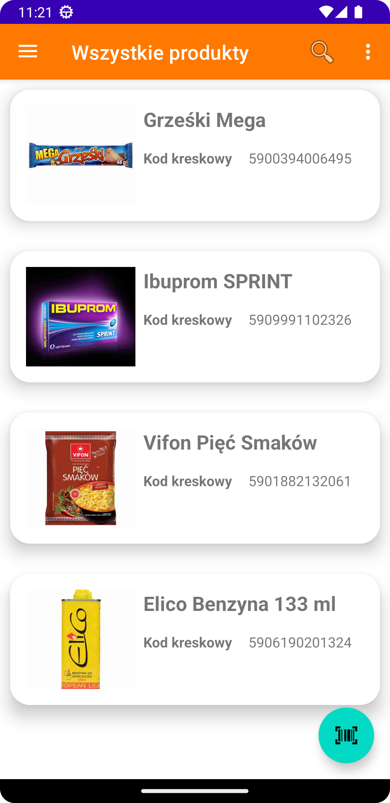
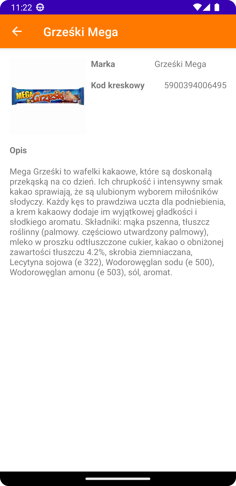
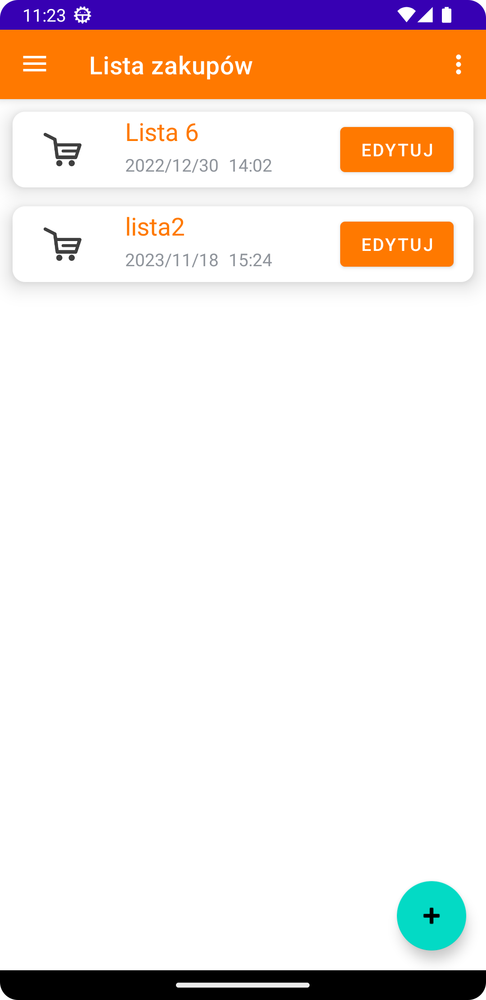
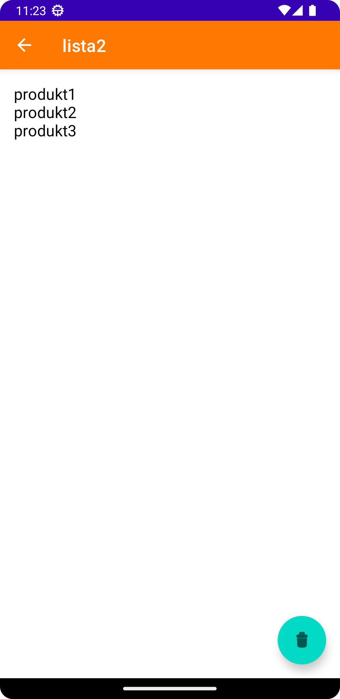
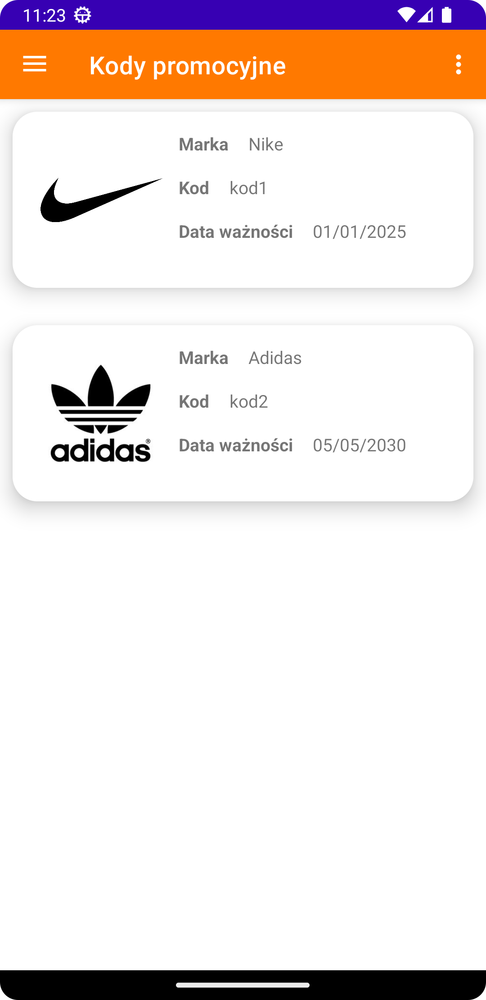
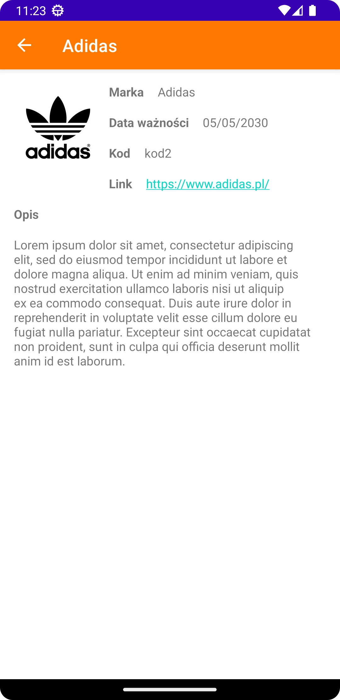
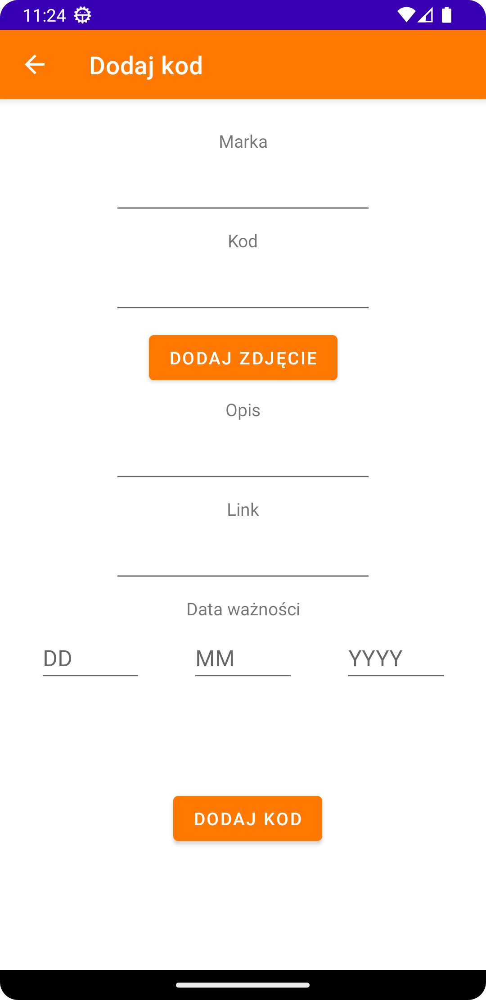
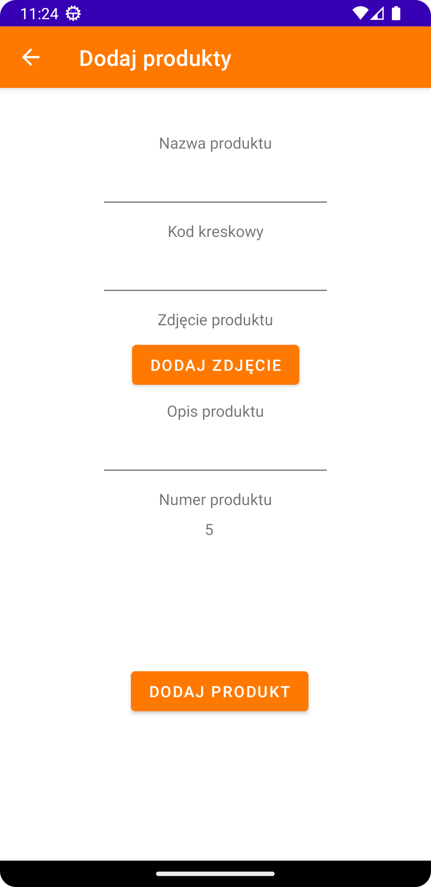

# Project Name
> Product-Description-Analyzer

## Table of Contents
* [General Info](#general-information)
* [Technologies Used](#technologies-used)
* [Features](#features)
* [Screenshots](#screenshots)
* [Project Status](#project-status)
* [Room for Improvement](#room-for-improvement)
* [Acknowledgements](#acknowledgements)
* [Contact](#contact)
<!-- * [License](#license) -->

## General Information
This app helps users get  informations about products they want to buy. They can look for a product in the database by searching its name or scanning a barcode.
Each user can create his own shopping list and use it offline whenever he wants.

## Technologies Used
- Java
- Firebase Realtime Database
- Firebase Storage

## Features
List the ready features here:
- Finding a product by its name or scanning its barcode and reading its description
- User has the ability to add a product to the database
- Each user can create his local shopping list - it's created using SQLite
- Users can also find promotional codes for stores

## Screenshots

<!-- If you have screenshots you'd like to share, include them here. -->

## Project Status
Project is: _no longer being worked on_. It was my graduation project, so I stopped working on it after I finished it.

## Room for Improvement

Room for improvement:
- Using Firebase Firestore instead of Firebase Realtime Database would be better with this kind of app.

## Acknowledgements
Give credit here.
- This project was inspired by Pepper app - an app that helps you find good offers in shops.

## Contact
Created by [krzysztofb200](github.com/krzysztofb200/) - feel free to contact me!

<!-- Optional -->
<!-- ## License -->
<!-- This project is open source and available under the [... License](). -->

<!-- You don't have to include all sections - just the one's relevant to your project -->
